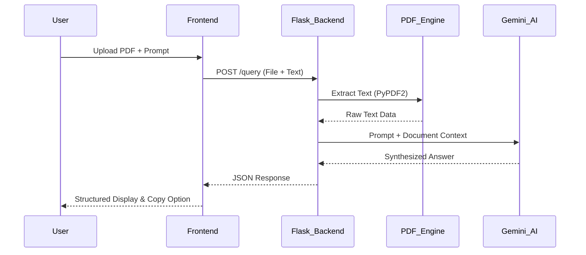

# 📄 PDF Oracle Agent

A high-performance RAG (Retrieval-Augmented Generation) system built with **Python**, **Flask**, and **Gemini 2.0**. This agent allows users to upload PDF documents and query them using AI to extract specific intelligence.

## 🚀 Features
* **Durable Infrastructure:** Automatic API key rotation and model verification.
* **Document Intelligence:** Extracts and analyzes text from unstructured PDF data.
* **Modern UI:** Responsive, glassmorphism interface built with Tailwind CSS.
* **Fault Tolerant:** Handles 429 (Rate Limit) and 503 (Server Busy) errors gracefully.

## 🛠️ Tech Stack
* **Backend:** Python / Flask
* **AI:** Google Gemini 2.0 SDK
* **PDF Engine:** PyPDF2
* **Frontend:** HTML5 / JavaScript / Tailwind CSS

## 📦 Installation & Setup

1. **Clone the repository:**
   ```bash
   git clone https://github.com/MSam-data/PDF_Oracle_Agent.git
   cd PDF_Oracle_Agent

2. **Install dependencies**
- `pip install -r requirements.txt`

3. **Find .env file**
add your API keys as:
- `GOOGLE_API_KEY=AIza_YOUR_API_KEY_1`
- `GOOGLE_API_KEY_2=AIza_YOUR_API_KEY_2`

4. **Run the application**
- `python main.py`

## The PDF Oracle (RAG Agent) pipeline Workflow.

